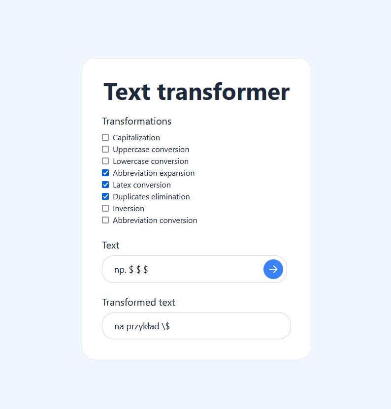

# Text transformer
A simple Java app with REST API in Spring with React as an user interface that enables text conversion written for our Software Engineering class.

# Project description
App enables user to:
* **change the case of letters**
* **reverse a string**
* **convert numbers to text in Polish** (Wpłać 100 złotych -> wpłać sto złotych)
* **convert selected words into abbreviations** (Pieczywo to na przykład chleb i bułki -> Pieczywo to np. chleb i bułki)
* **expand predefined abbreviations** (Pan Prof. spóźnił się na zajęcia -> Pan Profesor spóźnił się na zajęcia)
* **convert text to a format supported by Latex** (John Smith & Sons -> John Smith \& Sons)
* **eliminate duplicates** (Wyślij do do mnie wiadomość -> Wyślij do mnie wiadomość)
# Kanban board
https://trello.com/invite/b/6zMiAxyU/ATTI4f0ef2c1dc51eafee0a8b4aa80df0d9a887827AC/kanban-board
